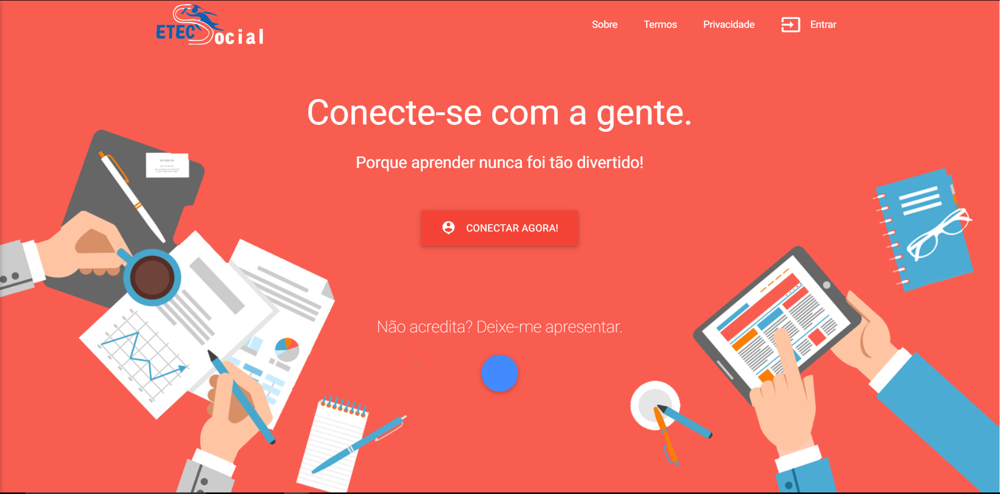
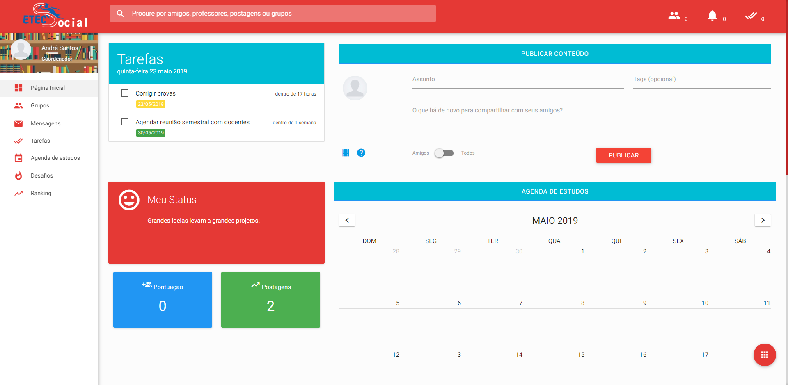

# Nota

O projeto ETEC Social foi desenvolvido em 2014 como Trabalho de Conclusão de Curso da ETEC Pedro Ferreira Alves (Mogi Mirim) e foi apresentado nas feiras FETEPS 2016 e FATEC de Portas Abertas, sendo um dos melhores projetos do ano de todas as ETEC's.

Mais tarde, em 2016, alunos da nova turma do curso de Informática para Internet puderam contribuir com melhorias, mas desde o ano seguinte o projeto havia sido descontinuado.

Em 2019, foi retomado o desenvolvimento da plataforma.

# Resumo

Visando criar um ambiente comum de interação entre alunos e professores, o sistema contará com uma série de ferramentas e funcionalidades que auxiliarão o aluno durante todo o período letivo, estimulando-o a aprender dentro e fora da escola, através de recursos interativos e inovadores.

Tecnologias utilizadas: PHP 7, Laravel, Materialize-CSS, jQuery, HTML5, CSS3, MySQL

- Saiba mais sobre o projeto através do link http://etecsocial.github.io

# Autores:
- Marcio Simões 
- Jhonatan Lopes

# Contribuintes:
- Eduardo Ramos
- Gabriel Ferreira

